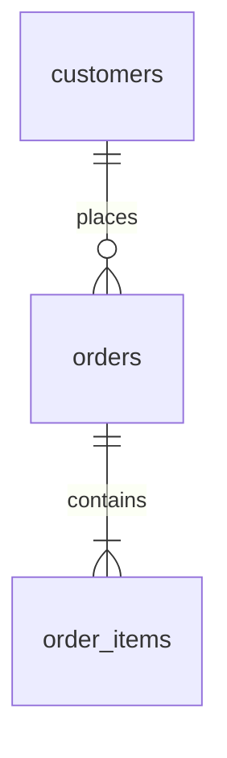

# Dataset README template (`src/datasets/<slug>/README.md`)

# <Nombre> (`<slug>`) · v<n>

## Contexto de negocio
Quién es la empresa ficticia, países y ciudades, monedas, modelo de negocio, período cubierto (fechas fijas), "hoy" del dataset.

## Diagrama de entidades

## Tablas y columnas
### `orders`
| Columna | Tipo | Clave | Descripción | Reglas |
|---|---|---|---|---|
| id | bigint | PK | … | … |
| customer_id | bigint | FK → customers.id | … | … |
| status | text | | pending → paid → shipped → delivered / cancelled / returned | transiciones válidas |

## Definiciones de negocio
Ingreso bruto, neto, pedido entregado, cliente activo, cohorte, etc.

## Problemas de calidad intencionales
| Problema | Tabla | Cantidad objetivo | Para qué sección |
|---|---|---|---|
| Clientes duplicados por email con mayúsculas | customers | ~40 | Deduplicación |

## Reglas de generación
Semilla, distribuciones (power-law, estacionalidad, picos), volúmenes por tabla, cómo se derivan totales.

## Volúmenes
| Tabla | Filas |
|---|---|

## Verificación
Lista de chequeos en `verify.ts` (totales, FKs, cronología, monedas, transiciones).

## Regenerar
`npm run datasets:build -- <slug>` → `npm run datasets:verify -- <slug>` → actualiza `manifest.json`. Cambiar datos = nueva versión.
