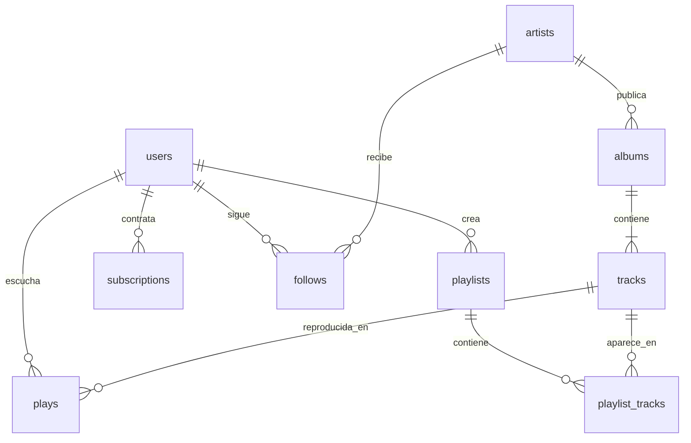

# Ritmo (`ritmo`) · v1

## Contexto de negocio

Ritmo es un servicio ficticio de streaming musical latinoamericano. Opera en seis mercados —México (MXN), Brasil (BRL), Argentina (ARS), Colombia (COP), Chile (CLP) y Perú (PEN)— con un catálogo propio de artistas, álbumes y canciones **totalmente inventados**: ningún nombre corresponde a una empresa, artista, sello o canción real.

El negocio es freemium: se escucha gratis y una parte de los oyentes contrata un plan `premium` o `familiar` a precio local. El período cubierto va del **2024-01-01** al **2025-09-15** (el "hoy" del dataset, fijo); el catálogo se publicó entre 2018 y junio de 2025. Generador determinista: misma semilla (`config.ts`) → mismos bytes y mismo `contentHash`. Esquema autoritativo: `src/content/datasets/ritmo.ts`.

## Diagrama de entidades



## Tablas y columnas

### `users` (5000)

| Columna    | Tipo        | Clave | Descripción                     | Reglas                                           |
| ---------- | ----------- | ----- | ------------------------------- | ------------------------------------------------ |
| id         | integer     | PK    | Oyente                          |                                                  |
| country    | char(2)     |       | MX, BR, AR, CO, CL o PE         | define moneda y huso horario                     |
| signup_at  | timestamptz |       | Alta                            | ≤ hoy; los registros crecen mes a mes            |
| plan_tier  | text        |       | free, premium o familiar        | = plan de la suscripción abierta, si no `free`   |
| age_band   | text        |       | 18-24, 25-34, 35-44, 45-54, 55+ |                                                  |
| churned_at | timestamptz |       | Abandono; NULL si sigue activo  | > `signup_at`; no hay reproducciones posteriores |

### `artists` (320)

| Columna           | Tipo    | Clave | Descripción                | Reglas                                            |
| ----------------- | ------- | ----- | -------------------------- | ------------------------------------------------- |
| id                | integer | PK    | Artista                    |                                                   |
| name              | text    |       | Nombre inventado           | único                                             |
| country           | char(2) |       | Origen                     | uno de los seis mercados                          |
| genre             | text    |       | Género principal           | coherente con el país (samba/sertanejo en BR…)    |
| monthly_listeners | integer |       | Oyentes mensuales públicos | ≥ oyentes distintos reales de los últimos 30 días |

### `albums` (794) y `tracks` (6751)

`albums(id, artist_id → artists.id, title, released_on)`: 1 a 5 álbumes por artista, publicados entre 2018-01-01 y 2025-06-30.
`tracks(id, album_id → albums.id, title, duration_seconds, is_explicit)`: 5 a 12 canciones por álbum, de 95 a 560 s (17 % explícitas). Las dos primeras canciones de cada álbum son los "singles" y concentran las reproducciones.

### `plays` (109 382) — tabla de hechos

| Columna        | Tipo        | Clave       | Descripción                   | Reglas                                                                    |
| -------------- | ----------- | ----------- | ----------------------------- | ------------------------------------------------------------------------- |
| id             | integer     | PK          | Reproducción                  | ordenadas cronológicamente por `played_at`                                |
| user_id        | integer     | FK → users  | Oyente                        |                                                                           |
| track_id       | integer     | FK → tracks | Canción                       | nunca anterior a la fecha de publicación del álbum                        |
| played_at      | timestamptz |             | Inicio (UTC)                  | ≥ `signup_at`, < hoy y ≤ `churned_at`                                     |
| seconds_played | integer     |             | Segundos escuchados           | ver problemas de calidad                                                  |
| device         | text        |             | mobile/desktop/web/tv/speaker | ver problemas de calidad                                                  |
| completed      | boolean     |             | Escucha completa              | verdadero ⇔ `seconds_played ≥ 90 %` de la duración (en las filas limpias) |

### `playlists` (3439) y `playlist_tracks` (21 962)

`playlists(id, user_id → users.id, name, created_at, is_public)`: creadas siempre después de la primera reproducción del dueño; 34 % públicas.
`playlist_tracks(id, playlist_id → playlists.id, track_id → tracks.id, position, added_at)`: sin canciones repetidas dentro de una lista, `position` de 1 a n sin huecos, `added_at ≥ created_at`.

### `subscriptions` (1289)

| Columna      | Tipo    | Clave      | Descripción                       | Reglas                                                  |
| ------------ | ------- | ---------- | --------------------------------- | ------------------------------------------------------- |
| id           | integer | PK         | Período de suscripción            |                                                         |
| user_id      | integer | FK → users | Oyente                            | nunca paga antes de su primera reproducción             |
| plan         | text    |            | premium o familiar                |                                                         |
| started_on   | date    |            | Inicio                            | períodos de un mismo oyente no se superponen            |
| ended_on     | date    |            | Fin; NULL = vigente               | > `started_on`; a lo sumo un período abierto por oyente |
| amount_minor | integer |            | Precio mensual (unidades menores) | precio de catálogo del plan en la moneda del país       |
| currency     | char(3) |            | MXN, BRL, ARS, COP, CLP, PEN      | = moneda del país del oyente                            |

### `follows` (14 839)

`follows(id, user_id → users.id, artist_id → artists.id, followed_at)`: un par (oyente, artista) aparece una sola vez; `followed_at ≥ signup_at`.

## Definiciones de negocio

- **Escucha válida / completada**: `completed = true`, es decir al menos el 90 % de la duración de la canción.
- **Oyente activo en un mes**: tiene al menos una fila en `plays` dentro de ese mes.
- **Cohorte**: mes de `signup_at`. La retención del mes _n_ es la proporción de la cohorte con actividad _n_ meses después.
- **Abandono (churn)**: `churned_at` no nulo; después de esa marca el oyente no tiene reproducciones y su suscripción está cerrada.
- **Embudo**: alta (5000) → primera reproducción (4768) → primera lista creada (2010) → primera suscripción paga (1225).
- **Suscriptores vigentes**: 737 oyentes con `ended_on IS NULL` (14,7 % de la base); 64 oyentes tienen más de un período (volvieron después de cancelar).
- **MRR aproximado**: suma de `amount_minor` de los períodos vigentes, por moneda (no hay tipo de cambio en este dataset: los importes no se suman entre monedas).

## Problemas de calidad intencionales

| Problema                                                    | Tabla | Cantidad     | Para qué sirve                               |
| ----------------------------------------------------------- | ----- | ------------ | -------------------------------------------- |
| Filas duplicadas exactas (mismo oyente, canción e instante) | plays | 340 pares    | Deduplicación (`DISTINCT`, `ROW_NUMBER`)     |
| `device` NULL                                               | plays | 1745 (1,6 %) | Manejo de NULL, `COALESCE`, agrupar por NULL |
| `seconds_played` NULL                                       | plays | 90           | NULL en agregaciones y promedios             |
| `seconds_played` negativo (−1 a −600)                       | plays | 120          | Filtros de saneamiento, `CASE`               |
| `seconds_played` mayor que la duración de la canción        | plays | 210          | Validación cruzada con `tracks`              |

Todos estos casos son detectables con SQL y están contados en `verify.ts`; ninguna otra inconsistencia es intencional.

## Reglas de generación

- Semilla `20260922` (`config.ts`), PRNG mulberry32 compartido (`src/datasets/_shared/prng.ts`); sin `Math.random` ni `Date.now()`. El "hoy" es la constante 2025-09-15T12:00Z.
- **Popularidad de artistas**: ley de Zipf (`1/rango^0.95`) con sesgo al país del oyente (62 % de sus artistas favoritos son locales); el 10 % más popular concentra el 54,6 % de las reproducciones.
- **Intensidad de escucha**: power-law por oyente (Pareto α = 1,15); cada oyente tiene entre 3 y 8 artistas favoritos que explican el 56 % de sus reproducciones.
- **Estacionalidad**: pico vespertino local (18–23 h ≈ 51,7 % de las escuchas, calculado con el huso de cada país), viernes a domingo +25 %, diciembre +20 %, luna de miel de 30 días tras el alta +12 %.
- **Altas y churn**: las altas crecen con el tiempo (exponente 0,72); el 55 % de los oyentes tiene vida útil exponencial de media 300 días, por lo que las cohortes viejas retienen menos (1276 oyentes con churn, 25,5 %).
- **Precios**: tabla fija por mercado y plan en `config.ts`; la suscripción siempre usa el precio de su plan y la moneda del país.

## Volúmenes

| Tabla           |   Filas |
| --------------- | ------: |
| users           |    5000 |
| artists         |     320 |
| albums          |     794 |
| tracks          |    6751 |
| plays           | 109 382 |
| playlists       |    3439 |
| playlist_tracks |  21 962 |
| subscriptions   |    1289 |
| follows         |  14 839 |
| **Total**       | 163 776 |

Snapshot: 8,1 MB de CSV, ≈ 2,1 MB comprimido (presupuesto: ≤ 4 MB gz).

## Verificación

`verify.ts` ejecuta 35 chequeos: volúmenes por tabla; integridad referencial y de calendario (altas, churn, publicación de álbumes); reproducciones dentro de la ventana de vida del oyente y nunca anteriores al lanzamiento de la canción; `completed` coherente con `seconds_played` en las filas limpias; orden cronológico de `plays`; concentración vespertina y cola larga de artistas; cantidad exacta de cada problema de calidad; unicidad y numeración de `playlist_tracks`; unicidad de `follows`; suscripciones sin solapamiento, con precio y moneda correctos, sin pagos previos a la primera escucha y coherentes con `users.plan_tier`; `monthly_listeners` nunca menor que la audiencia observada de 30 días.

## Regenerar

```
npm run datasets:build ritmo
npm run datasets:verify ritmo
```

El build escribe `public/datasets/ritmo/v1/` (ignorado por git) y actualiza `src/datasets/manifest.json`. Cambiar datos, volúmenes o semilla exige **subir la versión** y volver a verificar los ejercicios que usen el dataset.
